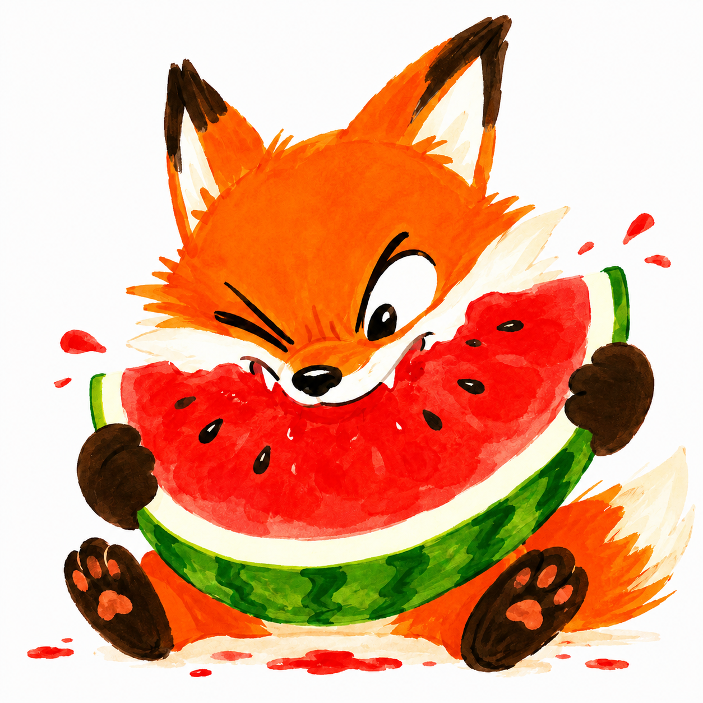

<!-- AUTO-GENERATED-HOMEPAGE: edit folders/posts in Obsidian; edit homepage layout in tools/sync-blog.ps1, not this file. -->

::: {.home-page}
::: {.home-hero}
::: {.home-title-scene}
# Foxmir

::: {.home-avatar-note tabindex="0" aria-label="Foxmir"}
::: {.fox-mark aria-hidden="true"}

:::
:::
:::

::: {.home-lines}

**RL is fun, isn’t it?**  
**If not, let me show you.**  
**If yes, let’s talk.**

:::
:::

::: {.home-section .home-latest-section}
::: {.home-section-label}
Latest
:::

::: {.home-section-main}
:::{#latest-listing}
:::
:::
:::

::: {.home-color-divider aria-hidden="true"}
:::

::: {.home-map}
::: {.map-item .map-item-bits}
::: {.map-item-head}
[Bits](bits.qmd)
:::

::: {.map-item-note}
Criteria, definitions, and short technical answers.
:::

::: {.map-item-latest}
:::{#bits-listing}
:::
:::
:::

::: {.map-item .map-item-learn}
::: {.map-item-head}
[Learn](learn.qmd)
:::

::: {.map-item-note}
Learning records and design reflections.
:::

::: {.map-item-latest}
:::{#learn-listing}
:::
:::
:::

::: {.map-item .map-item-reports}
::: {.map-item-head}
[Reports](reports.qmd)
:::

::: {.map-item-note}
Experiment reports, statistics, and result reading.
:::

::: {.map-item-latest}
:::{#reports-listing}
:::
:::
:::

::: {.map-item .map-item-articles}
::: {.map-item-head}
[Articles](articles.qmd)
:::

::: {.map-item-note}
Longer arguments when a question needs more room.
:::
:::

::: {.map-item .map-item-notes}
::: {.map-item-head}
[Notes](notes.qmd)
:::

::: {.map-item-note}
Loose fragments, sketches, and unfinished signals.
:::
:::

:::
:::
