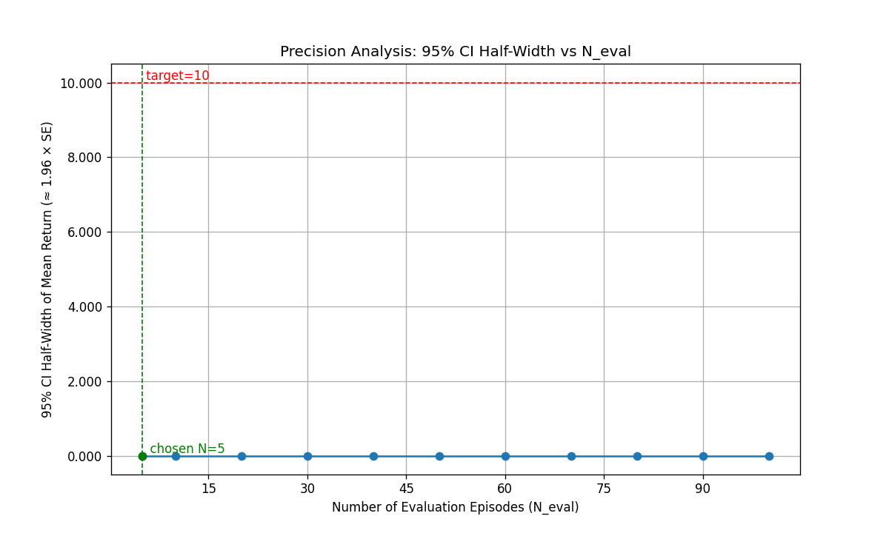
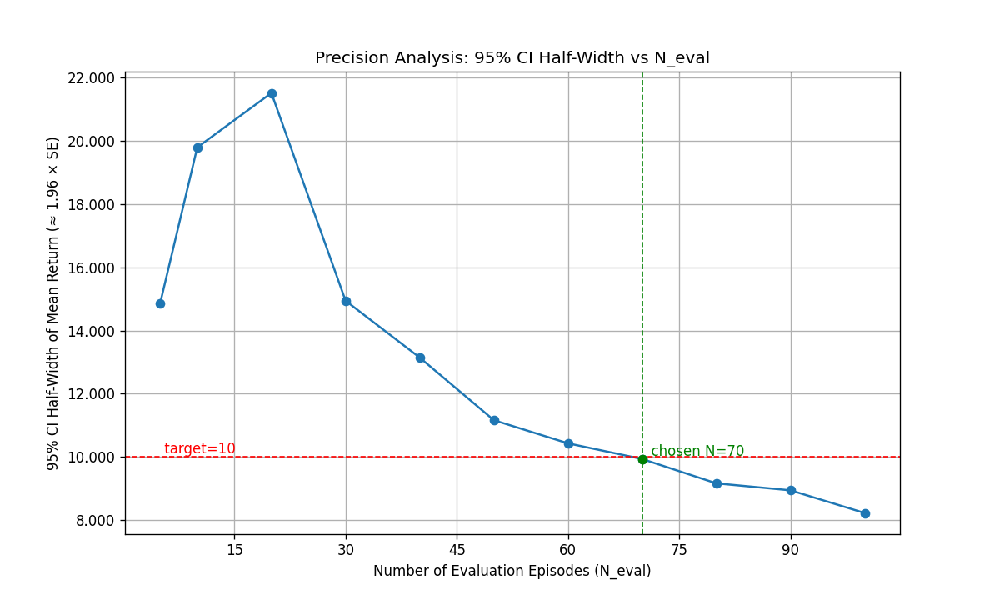
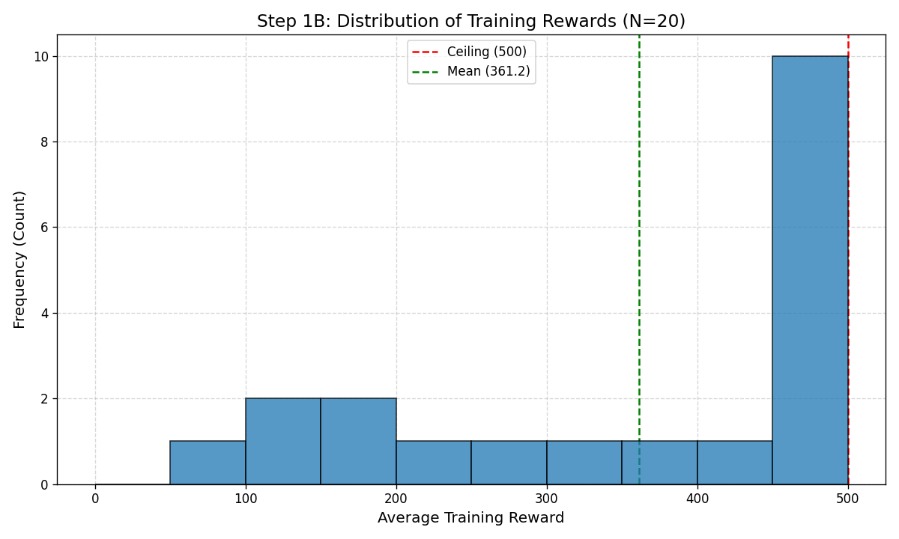
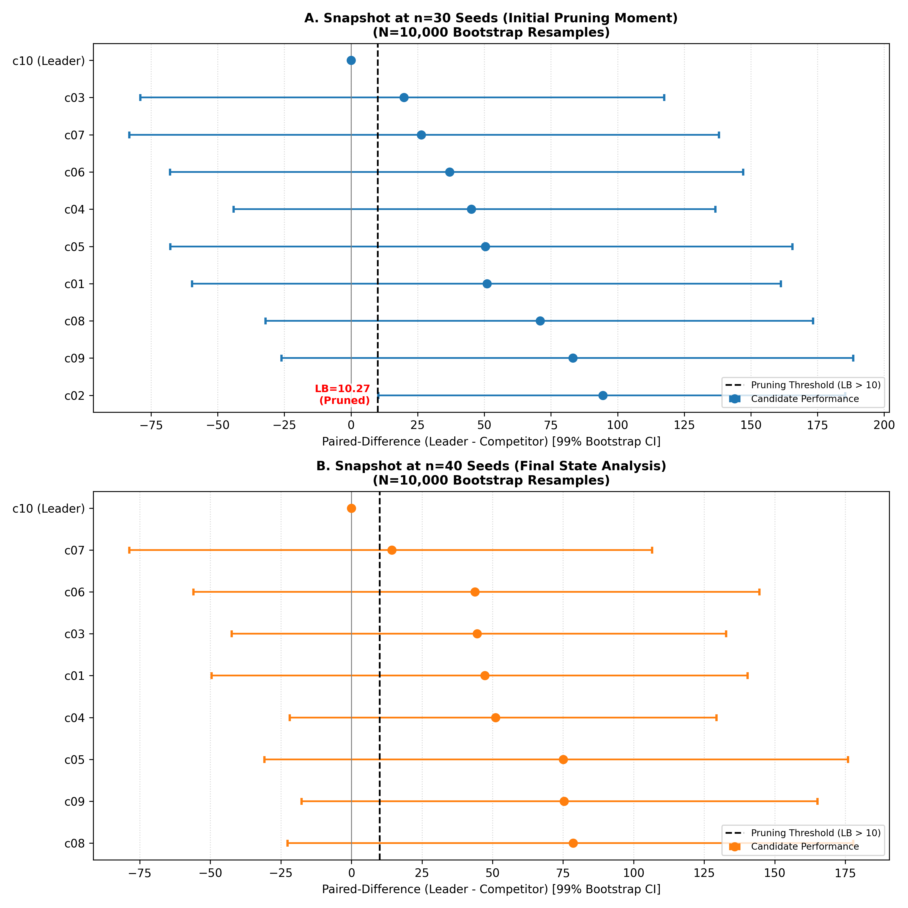
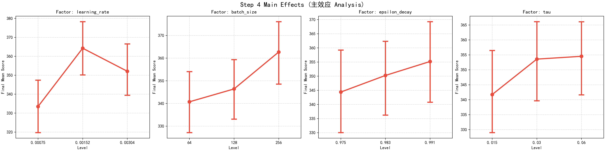

# Technical Report: Statistical Analysis of DQN on CartPole-v1

（Written on January 2, 2026 and completed on January 15, 2026）

---

# Abstract

Under constrained computational budgets, reinforcement learning experiments often face a severe conflict between statistical rigor and resource consumption. Using DQN training on CartPole-v1 as a case study, this report aims to quantify this conflict and explore hyperparameter sensitivity characteristics under strict statistical standards. We adopted a four-stage statistical experimental protocol: evaluation precision calibration, coarse screening via Bayesian optimization, incremental model selection based on bootstrap paired-difference confidence intervals (incorporating statistical pruning and adaptive early termination), and a full-factorial ANOVA local sensitivity analysis centered on the champion configuration. Empirical results reveal the high cost of maintaining statistical reliability in this specific RL project: the training phase exhibits high variance and significant deviation from normality, causing sample size estimates based on normal approximation to yield unrealistic requirements; pursuing equivalent rigor would require a training seed count ($N_{train} \approx 1000$) far exceeding typical budgets. Model selection within an acceptable training budget ($N_{train} = 40$) also demonstrated that strict paired-difference CIs prevented adaptive early termination from triggering and triggered statistical pruning only once, reflecting a direct conflict between rigor and efficiency. Local sensitivity analysis based on the champion hyperparameters further indicated that within the champion configuration's neighborhood, the residual term (stochastic noise) explained 95% of performance variation, with only the learning rate showing weak statistical significance ($\eta_p^2=0.0064$). These results suggest that under the current experimental budget, the marginal benefit of excessive local hyperparameter fine-tuning is extremely low and highly susceptible to stochastic interference; engineering practice should acknowledge this statistical reality. Increasing the number of training seeds and utilizing statistical aggregation are more reliable means for improving the cost-effectiveness of model selection or the reliability of sensitivity analysis.

---
# Introduction

The high sensitivity of reinforcement learning algorithms to initial conditions frequently exposes experimental conclusions to the risk of "pseudo-significance." In practical engineering and research, the core contradiction lies in the fact that limited computational budgets typically cannot support the large-scale repeated experiments required to eliminate stochastic fluctuations. This often forces researchers into a dilemma between "budgetary feasibility" and "statistical rigor." To quantify the practical impact of this contradiction, we used DQN/CartPole-v1 as a standardized case study to quantify this tension through a multi-stage experiment (experimental details are provided in Methods). The experimental statistical data address the following engineering practice questions:

1.  **Repetition Requirements and Distribution**: Given a precision target (e.g., mean error $\pm 10$), what are the minimal requirements for evaluation episodes and training seeds, respectively? In this standardized case, what are the scale of variance and the distribution shape of training returns across different random seeds?
2.  **Model Selection under Budget Constraints**: Under constrained training seed budgets, how much statistical discrimination does a strict paired-difference CI rule provide? What is the corresponding resource consumption and the triggering status of pruning/termination rules?
3.  **Effect Size and Explanatory Sources in the Champion Neighborhood**: Around the champion hyperparameters, what is the explanatory power/effect size of valid hyperparameter main effects and interaction effects on performance variation? How does this compare to the proportion of the residual term contributed by random seeds?

---

# Methods

## Overview

The experimental process was structured into four sequential stages, designed to balance computational efficiency with statistical rigor.

* **Step 1: Statistical Precision Analysis**: Establishing baseline requirements for evaluation and training seeds.
- **Step 2: Coarse Screening**: Identifying top-10 hyperparameter candidates via Bayesian optimization.
- **Step 3: Model Selection**: Identifying the optimal configuration through adaptive termination and statistical pruning.
- **Step 4: Sensitivity Analysis**: Assessing the robustness of the champion configuration by exploring its local hyperparameter landscape.

## Protocol-Pre

1. **Environmental Specification**: 
	1. CartPole-v1
	2. TimeLimit: 500 steps (corresponding to the full score of 500 points)
	3. Termination and Truncation Criteria:
		1. Termination: agent falls down
		2. Truncation:  agent reaches the time limit (500 steps)
2. **Training Benchmark**
	1. $\epsilon$-greedy policy: allow to explore
	2. every agent must run over the episode budget which is be given in advance
	3. Step 2 treats the number of episodes as a Bayesian hyperparameter
3. **Learning Benchmark**
	1. Episode Termination: Within the interaction loop, episodes end upon either natural termination or time truncation.
	2. Target Value Computation: In Deep Q-Network (DQN) target calculations, the next-state value term (future value) is omitted only upon natural termination. For time truncation, the future value is preserved to avoid biased value estimation.
	3. Implementation: A binary indicator modulates the next-state value term: it is set to 0 for natural termination and 1 for time truncation.
4. **Evaluation Benchmark**
	1. Deterministic Policy: $\epsilon = 0$
	2. Evaluation Schedule:
		1. A single evaluation phase is conducted post-training (consisting of $N_{eval}$ independent episodes, determined via precision analysis).
		2. No interim evaluation during the training.
		3. Step 3 includes an additional validation stage: after selecting the champion, we retrain the champion configuration using an independent set of 10 training seeds (disjoint from those used for model selection) and evaluate it using the same standardized evaluation protocol.
		4. In this report, $N_{eval}$ denotes the number of independent evaluation episodes, implemented by resetting the environment with a distinct evaluation seed per episode.
	3. Evaluation main metric: 
		1. Step 1A: Load a fixed checkpoint and execute independent evaluation episodes in evaluation mode ($\epsilon=0$). $N_{eval}$ is derived based on the Standard Deviation (SD) and Confidence Interval (CI) half-width of returns across evaluation episodes.
		2. Once $N_{eval}$ is determined, the evaluation protocol is finalized; all subsequent evaluations adhere to this standardized procedure.
5. **Reproducibility**
	1. Training–evaluation isolation: Training seeds (and all training-time randomness derived from them, including environment initialization) are disjoint from evaluation seeds.
	2. Cross-stage training-seed isolation (decision-critical stages): The training seed sets used in Steps 2–4 are mutually disjoint.
	3. Note on Step 1: Step 1 uses pilot seeds for diagnostic analysis and may overlap with Step 2; Step 1 outcomes do not participate in candidate ranking or champion selection.
	4. The specific mapping is provided in the Appendix.
6. **Budget Specifications**: 
	1. Step 1: $N_{episodes} = 500$
	2. Step 2: $N_{episodes} \in \{300, 400, 500\}$ as a discrete hyperparameter.
7. **Primary and Secondary Metrics**:
	1. Within the specified budget, mean evaluation return is the primary metric, and stability (SD) is the secondary metric. 
	2. Sample efficiency is not prioritized within this specific budget range.
8. **Hyperparameter Configuration**:
	1. **Baseline**:
		1. gamma: 0.99
		2. learning_rate 0.0005 (with Adam optimizer)
		3. epsilon_decay:0.9999
		4. tau: 0.005 (soft update)
		5.  replay buffer size: 40000
		6. num_episodes: 500
		7. batch_size: 128
	2. **Bayesian**:
		1. gamma: $[0.95, 0.999]$
		2. learning_rate: $[0.0001, 0.01]$
		3. epsilon_decay: $[0.98, 0.999]$
		4. tau: $[0.001, 0.05]$
		5. replay buffer size: $[10000, 20000, 30000, 40000, 50000]$
		6. num_episodes: $[300, 400, 500]$
		7. batch_size: $[64, 128, 256]$

## Step 1: Statistical Precision Analysis
### Step 1A: Evaluation Precision Analysis

This stage aims to quantify environmental stochasticity to determine the required number of evaluation seeds.

Step 1A first utilizes a large-scale pilot run (100 evaluation episodes) to obtain return samples, followed by calculating the CI half-width curve across different $n$ values to determine the minimum $N_{eval}$ that satisfies the $\pm10$ threshold.

To examine whether evaluation returns still exhibit observable fluctuations in the near-saturated performance region (thereby assessing the necessity of $N_{eval}$), a high-performance agent was selected for testing.

Preliminary tests indicated that a near-saturated policy (average train reward ≈470 points) exhibited near-zero variance during evaluation, which prevented reliable estimation of the environment's stochasticity.

To mitigate this ceiling effect, a non-saturated policy checkpoint (average train reward ≈250 points) was employed to retain sufficient variability.

Based on the 95% confidence-interval half-width of ±10 (2 % of the full score of 500 points), the required number of evaluation seeds was determined to be $N_{eval}=70$.

### Step 1B: Training Precision Analysis

The evaluation baseline was established as a 95%  confidence-interval half-width of ±10 points.

Empirical pilot studies ($N_{train}=20$) revealed a Left-skewed characterized by a dominant high-reward peak and a secondary low-reward peak. (SD ≈ 150).

Given the Non-Gaussian characteristics and the high variance , achieving the target precision would require $N_{train} \approx 1000$, which is computationally prohibitive. 

A multi-stage resource allocation was adopted to balance statistical rigor with computational constraints:
* Step 2 (Coarse Screening): $N_{train}=5$ to eliminate poorly performing configurations
* Step 3 (Model Selection): $N_{train} \in [20, 40]$ to identify the optimal configuration via adaptive sampling
* Step 4 (Sensitivity Analysis): $N_{train}=20$ to characterize the local hyperparameter landscape

## Protocol-Frozen

* deduce the Step 1 outcome:
	* Evaluation protocol added: $N_{eval}=70$ (derived from Step 1A)
	* Training protocol set as multi-stage strategy
* apply to Steps 2, 3, and 4

## Step 2: Coarse Screening

Preliminary screening's aim is to eliminate the terrible configurations but not for higher precision evaluation, so setting $N_{train}=5$ had already created the discrimination and the probability of losing the optimal configuration is low.

The top-10 candidates were selected after Bayesian optimization via a simple sort based on the evaluation outcome
## Step 3: Model Selection

Step 3 aims at identifying the optimal configuration through adaptive termination and statistical pruning. This allows for efficient resource allocation to high-potential candidate configurations. 

We compared the top-ranked configuration against all other candidate configurations. For each additional training seed (incremented synchronously across all candidates), we computed bootstrap resampling confidence intervals (CIs) for the paired differences based on the cumulative set of training seeds.

In consideration of the Type I error accumulation ,99% CI can mitigate inflation. 
In view of the full points = 500 , we chose the 2% of it (=10 points) as standard.

* After training all candidate configurations for 20 seeds (under 20 seeds is obviously not a reasonable number to up to enough variance to pick out the champion)

* Based on the top-ranked configuration compared with the second-ranked configuration, if the 99% paired-difference CI lower bound (LB) > 10, Model Selection terminated. When it occur, the top-ranked configuration is selected as the champion.
* Based on the top-ranked configuration compared with any other candidate configuration, if the 99% paired-difference CI lower bound (LB) > 10, prune that configuration. This means that it will not be eligible for subsequent champion selection

* If adaptive termination does not occur, continue training until $N_{train}=40$ seeds. The configuration with the highest mean evaluation return is selected as the champion.

To ensure maximum reliability, following the selection of the champion, we retrain the champion configuration using an independent set of 10 training seeds (disjoint from those used for model selection) and evaluate it using the same standardized evaluation protocol

We also took the controller-worker framework to run multiple agents at one time to reduce total wall-clock time.

## Step 4: Sensitivity Analysis

### Grid Search Specification

Centering on the champion configuration, adopting the full-factor design to view the landscape around.

We conducted a grid search based on 20 seeds with 4 factors at 3 levels.
* learning_rate: $[0.5x, 1x, 2x]$ 
* epsilon_decay: $[x-1.5a, x, x+a/1.5]$ ($a = 1 - x$)
* tau: $[0.5x, 1x, 2x]$ 
* batch_size: $[0.5x, 1x, 2x]$

Based on reinforcement learning (RL) nonlinearity, the level values are set to 0.5x, 1x, and 2x of the champion value.

Let $x$ denote the champion's epsilon decay and $a = 1 - x$ represent the decay intensity. The three levels for epsilon decay are constructed as $[x - 1.5a, x, x + a/1.5]$, with values clipped to the $(0, 1)$ interval to prevent out-of-bounds values.

### Statistical Analysis Protocol

After finishing all runs, we will report main effects, interaction effects, and $\eta^2$ via analysis of variance (ANOVA).

* **Method**: Four-way ANOVA (Type II Sum of Squares).
* **Dependent Variable**: Mean episode reward (averaged over 70 evaluation episodes).
* **Factors**: Learning Rate, Batch Size, Epsilon Decay, Tau (Full factorial with interactions).
* **Error Term**: Random seed variability is modeled as residual error.
* **Metric**: Partial Eta Squared ($\eta_p^2$) is used to rank factor importance.

---

# Results

Unless otherwise specified, configuration-level metrics (mean and SD) refer to statistics aggregated across training seeds; metrics in Step 1A specifically refer to statistics across evaluation episodes.

## Step 1

### Step 1A

**Figure 1**: 95% CI half-width as a function of $N_{eval}$ (red line: threshold=10; green line: selected minimum $N_{eval}$). For the saturated policy (mean=500, variance=0), the analysis yields a misleading requirement of $N_{eval}=5$. 

**Figure 2**: The same analysis for the non-saturated policy (mean=281.28, SD=41.76) correctly identifies $N_{eval}=70$, which was subsequently adopted for the evaluation protocol.

### Step 1B

**Figure 3**: Histogram of final returns across $N_{train}=20$ seeds (green line: mean; red line: 500-point ceiling). The performance exhibits a typical left-skewed distribution (mean ≈ 361.2, SD ≈ 159), highlighting significant non-Gaussianity and high variance.

## Step 2

The Bayesian optimization process evaluated 84 configurations. The top-10 candidates, with mean rewards ranging about $[45, 500]$ ($N_{train}=5$), were selected for subsequent rigorous pruning in Step 3. Detailed hyperparameter sets are provided in Appendix.

## Step 3

**Figure 4**: Paired-difference forest plots for Step 3 champion selection (dynamic baseline). At each snapshot ($n=30$ and $n=40$), candidates are ranked by mean return up to that seed count, and the top-ranked candidate is treated as the current leader (difference defined as 0). For each candidate i, we plot the mean of seed-wise paired differences (leader − i) and the 99% bootstrap resampling paired-difference CI computed with 10,000 resamples. The dashed line indicates the decision threshold of 10 points: a candidate meets the pruning/termination criterion if the CI lower bound (LB) > 10. At $n=30$, the 99% CI lower bound of the paired difference (leader − c02) exceeded 10, so c02 was pruned; hence it is absent at $n=40$. Under the budget cap ($N_{train}=40$), adaptive termination was never triggered and the final champion was selected by the highest mean return rather than by meeting the CI separation criterion.
* learning_rate: $[0.00075, 0.00152, 0.00304]$ 
* epsilon_decay: $[0.975, 0.983, 0.991]$
* tau: $[0.015, 0.030, 0.060]$ 
* batch_size: $[64, 128, 256]$
	1. gamma: 0.979669671
	2. learning_rate 0.001516538
	3. epsilon_decay:0.983003997
	4. tau: 0.030475336 (soft update)
	5.  replay buffer size: 40000
	6. num_episodes: 500
	7. batch_size: 128

We further validated the champion configuration by retraining it with 10 additional independent training seeds and evaluating it with the same standardized protocol ($N_{eval}=70$). Across these training seeds, Mean = 329.63, SD = 190.51.

## Step 4 

Based on the predefined grid search standard, centering on the champion configuration, we set the configuration as:
* learning_rate: $[0.00075, 0.00152, 0.00304]$
* epsilon_decay: $[0.975, 0.983, 0.991]$
* tau: $[0.015, 0.030, 0.060]$
* batch_size: $[64, 128, 256]$

| factors                        | sum_sq      | df   | F    | PR(>F) | eta_sq_partial |
| -------------------------------| ----------- | ---- | ---- | ------ | -------------- |
| C(learning_rate)               | 259730.145  | 2    | 4.98 | 0.007  | 0.0064         |
| C(batch_size)                  | 140436.5383 | 2    | 2.7  | 0.0679 | 0.0035         |
| C(learning_rate):C(batch_size) | 161737.5107 | 4    | 1.55 | 0.1848 | 0.004          |
| C(tau)                         | 54941.59155 | 2    | 1.05 | 0.3487 | 0.0014         |
| C(epsilon_decay)               | 31610.40856 | 2    | 0.61 | 0.5453 | 0.0008         |
| Residual                       | 40097636.42 | 1539 |NA    |NA      |NA              |

**Table 1**: ANOVA Results (Top Effects). $df$ = degrees of freedom; $SS$ = sum of squares; $\eta_p^2$ = partial eta-squared. The analysis includes four factors: Learning Rate, Batch Size, Epsilon Decay, and Tau.

**Figure 5**: Main Effects of Hyperparameters on Agent Performance. Error bars represent 95% confidence intervals. Only Learning Rate shows a statistically significant non-monotonic effect ($p < 0.05$), peaking at the intermediate level.

A four-way ANOVA evaluated the effects of Learning Rate, Batch Size, Epsilon Decay, and Tau on mean episode reward (Table 1). The analysis showed that the **Residual** term accounted for the majority of the variance ($SS_{residual} \approx 4.0 \times 10^7$), representing approximately **95%** of the total sums of squares(from the full ANOVA table; see Appendix).

Among the hyperparameters, only **Learning Rate** exhibited a statistically significant main effect ($F(2, 1539) = 4.98, p = 0.007$), though with a small effect size ($\eta_p^2 = 0.0064$). As shown in Figure 5, comparisons of means indicated an inverted-V trend, with the highest reward observed at the intermediate level ($1.52 \times 10^{-3}$).

Neither **Batch Size**, **Epsilon Decay**, **Tau**, nor any interaction effects reached statistical significance at the $\alpha = 0.05$ level.

---

# Discussion

## The Trade-off between Statistical Rigor and Pruning Efficiency

We noticed that during Step 3 (Model Selection), adaptive termination was not triggered, and statistical pruning was triggered only once across 20 opportunities.

This highlights the inevitable tension between rigorous statistical standards and computational efficiency under the premise of limited budget

### The trade-off between mean signals and uncertain noise

The uncertainty of paired differences outweighed the actual performance advantages among all candidates led to an inability to meet the standard of adaptive termination and the statistical pruning under very limited budget.

It can be seen from the figure that (seed = 30, for example) all candidates (except for the champion) have mean differences (blue dot) $m$ within approximately $[10,100]$. And the corresponding lower bound penalty $u$ is usually within $[90,120]$.

The triggered condition of the adaptive termination and the statistical pruning is $LB > 10$. And $LB > 10 \iff m - u > 10$. So the relative size of $m$ and $u$ is crucial to the trigger. The wide spread of $m$ minus the sufficiently large $u$ led most paired difference CI lower bounds to fail to reach 10.

This mismatch stems from the superposition of two mechanisms
1. **One side, the upper bound of $m$ is limited by the ceiling effect and the Bayesian optimization.**
	1. ceiling effect (points=500) greatly compressed these agents that should have had a high degree of discrimination. When the agent get to 500 points in one round, whatever its performance potency is just over 500 points or far over 500 points, we all terminated it off and set its  points=500.(See the analysis of ceiling effect in the following text:the ceiling effect also induced evaluation variance collapse)
	2. Step 2 (coarse screening) is in charge of selecting the top-10 candidates via Bayesian optimization. These high-performing candidates offer very limited discrimination compared to common candidates, which makes Step 3 (model selection) more difficult.

2. **On another side, the high degree of uncertainty hinted at by $u$ is due to the limited budget.**
	1. The $u$ level is inherently sensitive to the sample size. The smaller the sample quantity, the greater the sampling uncertainty of the ($\bar d^{*}$) mean difference estimation, and the more difficult it is to push up the LB.
	2. Step 1B precision analysis indicated very high need of the training seeds (approximately 1000), which is beyond practical constraints. With a budget capped at $N_{train}=40$, the bootstrap distribution of the mean difference remains relatively dispersed. This dispersion forces the robust lower bound (0.5th percentile). And that led the distance from the mean to this 0.5th percentile remains high. So the $u$ is at a high magnitude (around 90–120).
	3. Had the budget been significantly larger, this distribution would have tightened, reducing uncertainty and potentially allowing pruning/termination to trigger. However, computational constraints made this infeasible.

### Rigor statistic rule 

To further reduce computational costs within a limited budget, we performed paired-difference CI calculations and decision interventions on a per-seed basis. The presence of sequential decision-making further increased the penalty stringency, leading to extremely high evaluation criteria, which in turn made adaptive early termination and statistical pruning difficult to trigger.

1. **Paired-difference CIs enhance computational efficiency and fairness.** Since RL agents exhibit high sensitivity to initial conditions (training seeds), comparing hyperparameter configurations requires accounting for seed-specific variance. By calculating paired differences on a per-seed basis rather than traditional cross-seed averages, we isolate the relative performance of candidates from the underlying "difficulty" of specific seeds.

2. **A 99% CI was adopted to mitigate the inflation of family-wise error rates.** Sequential decision-making inherently increases the cumulative risk of Type I error. To maintain statistical rigor, we employed a stricter decision threshold compared to the standard 95% CI. In implementation, we used the lower bound of a two-sided 99% CI (0.5th percentile), which is slightly more conservative than a one-sided 99% lower confidence bound (1st percentile). While this high bar protects the accuracy of model selection, it objectively reduces the sensitivity of the pruning mechanism.

3. **Bootstrap percentile CIs were used due to unknown distribution characteristics**. Given the non-Gaussian characteristics observed in Step 1B (see Section Step 1B below), we maintained an agnostic stance toward the distribution of paired differences in Step 3. To ensure the robustness of our evaluation criteria, we bypassed traditional $t$-tests in favor of a bootstrap percentile confidence interval (CI). This method constructs the interval directly from the 0.5th and 99.5th percentiles of the empirical distribution derived from 10,000 resamples, enabling rigorous estimation of performance differences without relying on normality assumptions.

The "high decision threshold" is an inevitable consequence of prioritizing statistical rigor. This "efficiency loss" represents a necessary cost to maintain the reliability of conclusions under a constrained computational budget.

### Practical Insights from Model Selection

1. **Inherent Randomness and Budgetary Tension:** Randomness is a core characteristic of RL experiments. Under limited budgets, a natural tension exists between computational efficiency and statistical rigor. Experiment designers must explicitly decide on the balance between these two factors beforehand.

2. **The Value of Pilot Studies:** Conducting small-scale, rapid pilot experiments is highly beneficial. These preliminary tests provide essential cues for defining the statistical balance and designing the overall experimental architecture.

3. **Optimizing Decision Criteria:**
	1. **Transition from per-seed checks to interval-based checks:** Instead of checking after every seed (starting at $n=20$), evaluate only at specific intervals (e.g., $n=20, 30, 40$). This reduces alpha inflation, allowing for the calibration of relatively conservative decision criteria.
	2. **Utilize one-sided CIs:** Using a one-sided CI instead of a two-sided CI as the decision criterion (with a critical quantile of 1% rather than 0.5%) makes the threshold easier to trigger and enhances statistical power.

4. **Optimizing Candidate Samples:** Reducing the number of candidates, such as selecting only the Top-5.
	1. **Multi-stage screening:** Implement an additional simplified screening step following the coarse screening to ensure only an elite group enters the model selection phase.
	2. **Accepting Bayesian randomness:** Accept higher inherent randomness from the Bayesian optimization stage by directly selecting a smaller number of candidates for the final model selection process.

5. **Architectural Optimization:** Utilizing a controller-worker framework during the model selection phase—enabling the parallel execution of multiple configurations—can significantly reduce total wall-clock time. 

---

## Non-Gaussian characteristics of configuration performance over train seeds suggest very high computational cost

### Non-Gaussian characteristics of configuration performance over train seeds

Results from Step 1B (Figure 3) reveal that hyperparameter performance across seeds follows a typical left-skewed distribution with significant volatility (SD ≈ 150). This distribution reflects the bifurcation characteristics of DQN on the CartPole task. Due to the distinct dynamical boundary between the target state (balance) and failure (tipping), training typically evolves into two divergent outcomes: agents either enter a stable equilibrium (near 500 points) or collapse early (low scores). This qualitative divergence leads to a sparsity of intermediate samples.

To capture sufficient performance differences, we set a rigorous precision target of ±10 points (2% of the total score). Given the observed SD ≈ 150, the sample size formula $n \propto (SD/d)^2$ dictates that $N_{train} \approx 1000$ training seeds would be required—a computationally prohibitive cost that necessitated our multi-stage resource allocation strategy. (Note: Since $N_{train} \approx 1000$ was estimated assuming normality, the actual requirement for a heavy-tailed, skewed distribution would be even higher).

### Practical Insights from Step 1B Precision Analysis

The non-normal distribution revealed in Step 1B motivated our use of bootstrap percentile CIs in Step 3, rather than parametric formulas, ensuring fairness and reliability in champion selection. In RL, raw performance data is frequently non-Gaussian; statistical theory (e.g., Chebyshev’s inequality) suggests that heavy-tailed distributions require significantly larger sample sizes than normal distributions to achieve the same confidence level. 

Relying on Gaussian-based sample size estimates in such cases leads to insufficient statistical power, causing subsequent analyses to fail:
1.  **Failure of Confidence Intervals**: In left-skewed distributions, low-score "failures" are sparse, high-risk events. Insufficient sampling often fails to capture these tail events, causing the mean to be dominated by high scores. This results in CIs that shift towards higher values and fail to cover the true mean, which includes the risk of failure.
2.  **Failure of Hypothesis Testing**: When sample sizes are inadequate for non-normal data, the estimation error may exceed the actual performance difference between two policies. In this scenario, "good luck" (seed variance) masks "true capability," significantly increasing the probability of statistical irreproducibility.

---

## the near-saturated policies show  ~0 evaluation variance is a pseudo-high-precision trap

### The near-saturated policies show ~0 evaluation variance is a "pseudo-high-precision trap"

In Step 1A, evaluating a high-performance agent yielded zero variance (100 episodes at 500 points). Relying on this result to infer that a very small $N_{eval}$ is sufficient is a "pseudo-high-precision trap":

1.  **Zero variance does not equate to low environmental stochasticity**. We calibrate $N_{eval}$ based on the fluctuation of evaluation returns across seeds. Under a fixed protocol, the observed return distribution is determined by the policy's interaction with the specific evaluation seeds.
    * Since CartPole-v1 dynamics are largely deterministic (stochasticity arises primarily from initial state resets), longer survival does not necessarily accumulate environment-driven noise.
    * In a counterfactual setting without a 500-point limit, high-performance agents would show variance far beyond the cutoff. In practice, the ceiling effect truncates all such performances to exactly 500.
    * Consequently, saturated policies mask the underlying stochasticity of the environment, creating an illusion of zero-variance evaluation.

2.  **Calibration via Non-Saturated Policies**: By switching to a non-saturated policy (mean ≈ 281.28, SD ≈ 41.76), we allowed the returns to fluctuate, effectively exposing the environmental stochasticity. This yielded the required $N_{eval}=70$, providing a robust foundation for the evaluation protocol.

---

## Hyperparameter Sensitivity and Local Landscape Characterization

This section presents a local sensitivity analysis centered on the champion hyperparameters selected in Step 3. We employed a Full Factorial Grid Search combined with N-way ANOVA. As a balanced experimental design, this approach yields results with high interpretability. It should be noted that this interpretability applies only to the current local parameter neighborhood and does not represent the characteristics of the global parameter space.
### High System Sensitivity to Random Seeds

Experimental results show that the **Residual** term, unexplained by hyperparameter factors, dominates the total sum of squares, accounting for approximately 95%. Under the current experimental setting (where training stochasticity is driven by training seeds), this indicates that model performance is highly sensitive to randomness during the training process.

In Step 1B, we observed significant non-Gaussian characteristics and high variance for a single hyperparameter configuration across different training seeds. The current Step 4 ANOVA results (extremely high Residual proportion) corroborate the observations from Step 1B: different training seeds lead to significant performance fluctuations. Consequently, attempting to fully average out training stochasticity through large-scale repetition would incur extremely high computational costs; this also explains why the strategy of multi-stage incremental training seeds adopted in Step 3 was necessary.

### Hyperparameter Robustness Reveals a Flat Parameter Space

After testing against the residual as the error term, no factors except Learning Rate showed statistical significance. This implies that within the current local parameter neighborhood, differences in these hyperparameter levels have a relatively limited impact on performance, presenting an overall flat local landscape. Therefore, small parameter drifts within this neighborhood are unlikely to cause a systemic collapse in performance. Given that this grid was constructed centered on the champion configuration, this result aligns with the Step 3 model selection conclusion, indicating that the champion configuration possesses good parameter robustness in this local region.

Within this local region, although Learning Rate is statistically significant ($p=0.007$), the effect size is small ($\eta_p^2=0.0064$), indicating a limited proportion of explainable performance variation. The main effects plot (Figure 5) shows an inverted-V trend for Learning Rate, with the peak corresponding to the intermediate level of this grid (which is also the champion configuration's Learning Rate), suggesting that a local optimum exists for Learning Rate in this neighborhood.

Overall, the dominance of training stochasticity implies that further hyperparameter fine-tuning yields low marginal returns. If further parameter fine-tuning is still desired within this neighborhood, Learning Rate is the dimension most likely to yield detectable gains, and a relatively optimal range exists. Meanwhile, since different training seeds lead to significant performance fluctuations, reliable evaluation should rely on multi-seed repetition and statistical aggregation rather than single-run results.

 ### Practical Insights from Step 4 Sensitivity Analysis

Given that the system possesses high seed sensitivity and the local hyperparameter landscape is relatively flat:

1.  Continuing sensitivity analysis with finer hyperparameter levels in the current neighborhood likely offers limited marginal return and high computational cost.
2.  If further parameter fine-tuning is still desired, Learning Rate is the dimension worth prioritizing.
3.  If the goal is to improve the cost-effectiveness of the overall training pipeline (obtaining more reproducible results under a given algorithm and training budget), priority should be given to increasing the number of training seeds and reporting cross-seed statistical summaries, rather than relying on single-run results from a few seeds.
4.  If the goal is to significantly raise the performance ceiling, changes to the algorithm structure or training mechanism may be more effective than local hyperparameter fine-tuning.

---

# Appendix
 
1. **Random Seeds and Isolation Policy**
	1. **Evaluation seeds**
	   We use a fixed evaluation-seed set $20000–20069 (inclusive)$, corresponding to $N_{eval}=70$ independent evaluation episodes (one seed per episode).
	2. **Training seeds by stage** (all ranges are inclusive):
	   * Step 1A (training seed for the non-saturated checkpoint used in evaluation calibration): ${42}$
	   * Step 1B (training-return distribution profiling): $42–61$
	   * Step 2 (Bayesian coarse screening): $42–46$
	   * Step 3 (model-selection training seeds): $1–40$
	   * Step 3 (post-selection independent retraining validation): $101–110$
	   * Step 4 (local sensitivity analysis): $501–520$
	1. **Mapping from training seed to environment reset seed**
	   To ensure that training-time environment initialization does not overlap with evaluation seeds, we derive environment reset seeds from training seeds using a piecewise mapping:
	   $$
	   seed_{env} =
	   \begin{cases}
	   seed_{train}\times 10000, & seed_{train}\neq 2\\
	   seed_{train}\times 10000^2, & seed_{train}=2
	   \end{cases}
	   $$
	   The special case avoids a collision between the default mapping and the evaluation-seed interval. The exact implementation is provided in the code and Appendix. 
2. The full ANOVA table:[Full_Table1_step4_anova_report.csv](../_attachments/reports/cartpole-dqn-report/Full_Table1_step4_anova_report.csv)
3. Open-source code repository.
4. Hyperparameter configurations for the top-10 candidates.

